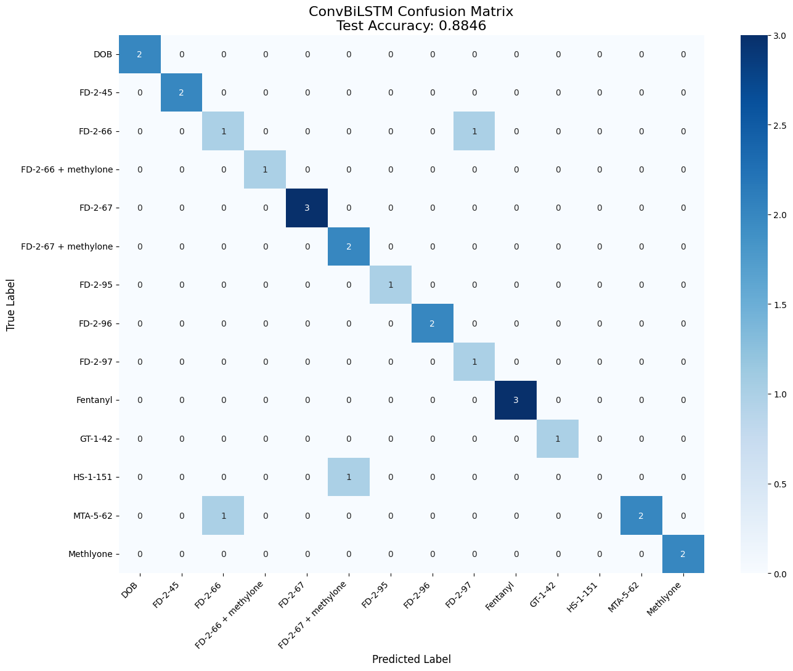

# High-Throughput Zebrafish Behavioral Phenotyping via Hybrid CNN-BiLSTM

[](https://www.python.org/downloads/)
[](https://pytorch.org/)
[](https://opensource.org/licenses/MIT)

## 📌 Project Overview
This research project develops an automated, end-to-end Machine Learning pipeline to classify complex zebrafish behavioral responses to **15 different chemical compounds**. The system utilizes Computer Vision and Deep Learning to identify subtle behavioral phenotypes in zebrafish, providing a high-sensitivity tool for toxicology and pharmacology research.

## 🚀 Key Engineering Highlights

### 1. Large-Scale Data Engineering
* **High-Volume Processing**: Engineered a pipeline to handle approximately **120GB of raw video data** from roughly 350 videos.
* **Efficient Feature Extraction**: Utilized **FFmpeg** to stream raw RGB frames directly into a pre-trained ResNet50 model, reducing storage requirements by over 99.9% while maintaining temporal dynamics.
* **Temporal Feature Engineering**: Implemented a **"Delta Trick"** ($Feature_t - Feature_{t-1}$) to simulate swimming speed and acceleration, significantly boosting model sensitivity to sudden motion changes.

### 2. Hybrid Model Architecture
The project implements a robust **ConvBiLSTM** architecture:
* **1D-CNN Layer**: Extracts local temporal patterns and smooths motion features.
* **Bidirectional LSTM**: Captures global, long-term temporal dependencies in swimming behavior.
* **Global Average Pooling**: Enhances robustness against temporal noise and varying sequence lengths.

## 📊 Performance & Results
* **Test Accuracy**: Achieved a test accuracy of **88.46%** across 15 fine-grained classes.
* 
* **Optimization**: Optimized using **Label Smoothing**, **Cosine Annealing**, and specialized **Time-Series Augmentations** including Jittering and Time Masking.

## 📂 Repository Structure
```text
src/
├── data/           # Dataset classes and Video Processing logic
├── models/         # Hybrid CNN-BiLSTM architectures
├── utils/          # Augmentation and Visualization tools
└── train.py        # Main training and evaluation script
config.yaml         # Hyperparameter and path management
requirements.txt    # Project dependencies# Drug_screening_zebrafish
